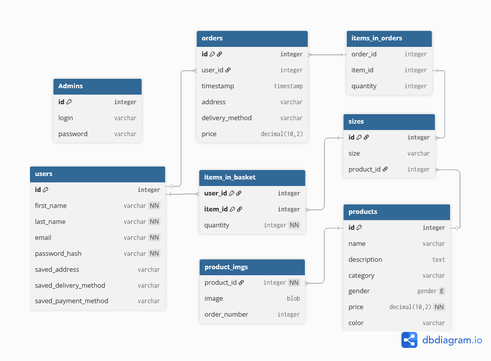
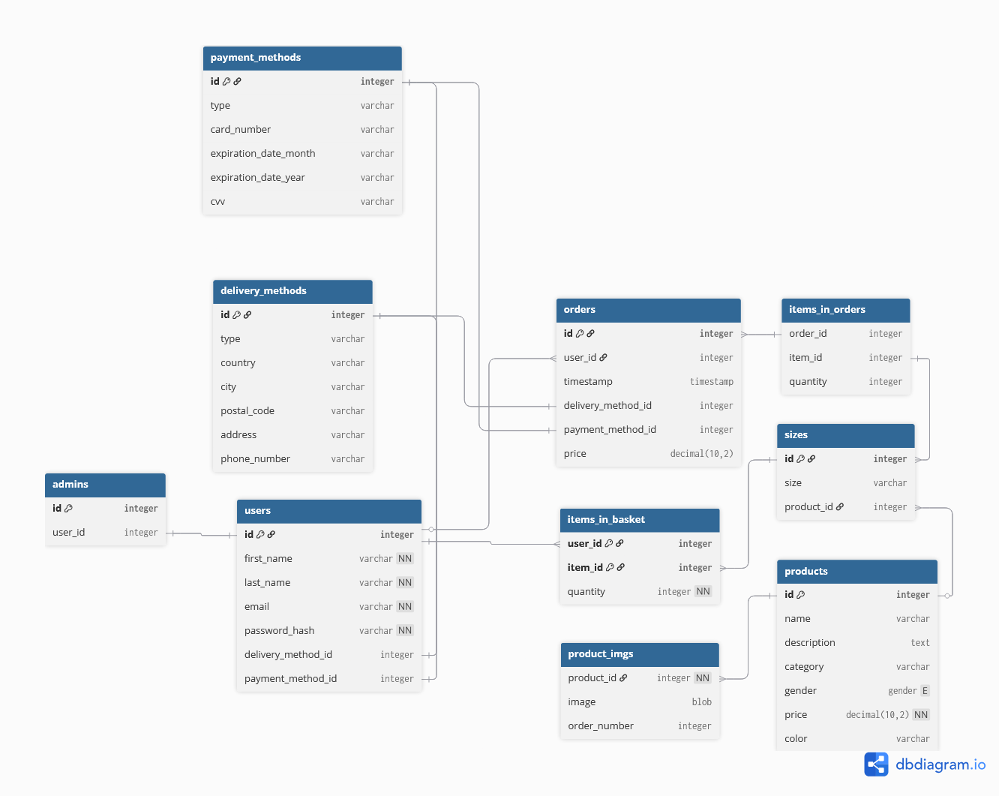
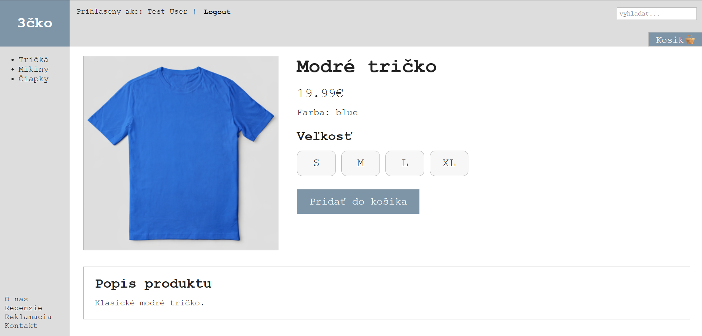
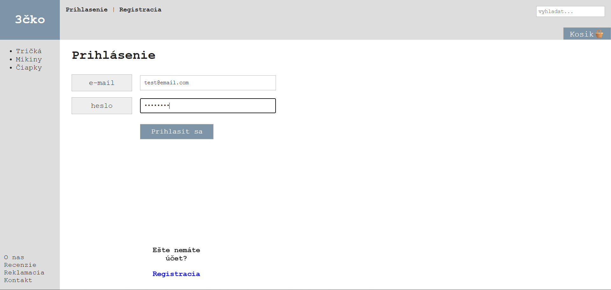
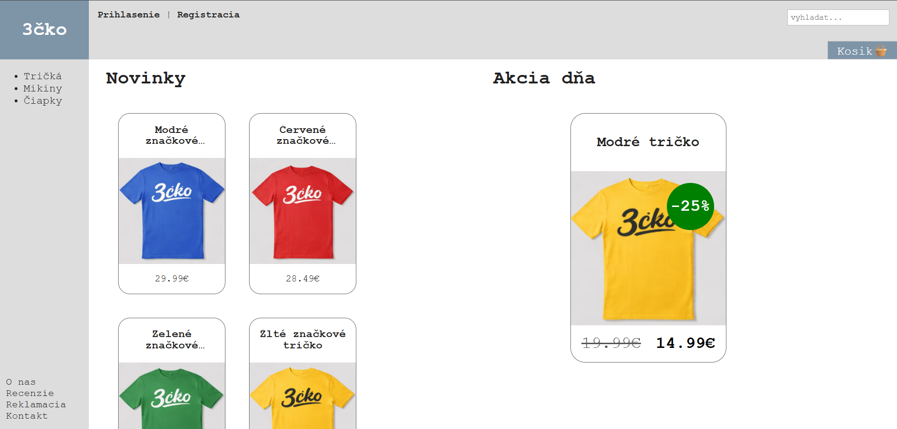
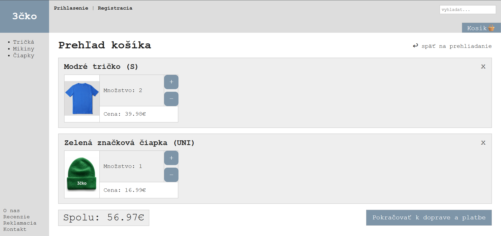

# WTECH Eshop "3cko" - Documentation

## Task:

### 1. Customer Section

- Display an overview of all products in the user's selected category
  - Basic filtering (based on at least 3 attributes, e.g., price range, brand, color)

  - Pagination

  - Sorting of products (at least by price, ascending/descending)

- display of a specific product - product details
  - add product to cart (any quantity; note: if quantity does not apply to the selected product category, this feature may not be implemented, e.g., car sales)

- full-text search across the product catalog

- display of shopping cart
  - change quantity for a given product

  - remove product

  - select shipping method

  - select payment method

  - enter shipping information

  - complete order

  - allow purchasing without logging in, considering the possibility of logging in later (note: careful consideration is needed to ensure this use case is implemented correctly)

  - Shopping cart portability for logged-in users

- User/customer registration

- User/customer login

- Customer logout

### 2. Administrator Section

- Administrator login to the e-shop admin interface

- Administrator logout from the admin interface

- Creation of a new product by the administrator via the admin
  interface
  - The product must include at least a name, description, and at least 2 photos

- Editing/deleting an existing product by the administrator via the admin interface

## Datamodel

### 1. Old Model



### 2. New Model



### 3. Changes

- Admin table now stores only `user_id` instead of `login` and `password` to be able to handle login workflow once for users, without creating a separate login handling for admin

- Remade payment methods and delivery methods logic, the database now stores it in separate tables to be able to store more information and reuse it.

## Design Decisions

1. In our project we didn't use recommended bootstrap for responsive design. Instead plain CSS media queries and flexboxes were used for mobile screens adoptation. This makes the project more lightweight and gives more control over how the components will be displayed in the app.

2. We decided to store user's checkout information in sessions instead of cookies. This gives more security as session data is stored server side and is not modifiable by user

## Brief Description of the Implementation of Selected Use Cases

### 1. Changing the Quantity for a Given Product

In our application changing quantity for a product stored in the basket is possible via user interface. You can decrease or increase the quantity with the dedicated button witch will change the `quantity` field of `items_in_basket` table in the database or in session data if user is not authenticated. If the quantity is less than 1 the product is removed from the basket.

### 2. Logging In

The user types their email and password to login. If the credentials are wrong the error message is printed on the screen and the user can try again. If the credentials are successful the database generates a session token that is stored both on the database and browser cookies. The session token is sent to the server with every request to make sure user is authenticated and allowed to perform actions only authenticated users are allowed to perform. When logging out this token is deleted.

### 3. Searching

Searching looks for all products in the database whose name, description, category or color match the input user typed in.

Example query with searching for "modr"

```sql
SELECT *
FROM products
WHERE name ILIKE '%modr%'
OR description ILIKE '%modr%'
OR category ILIKE '%modr%'
OR color ILIKE '%modr%';
```

### 4. Adding a Product to the Cart

Adding a product to the cart adds it to the `items_in_basket` table with has `user_id`, `item_id` and `quantity`. In case of unauthenticated user the item is added to the session data with only `item_id` and `quantity`. If the user logs in or registers the items from sessions are added to the user's account.

### 5. Pagination

Pagination selects specific amount of products matched by the SQL quarry controlled by `LIMIT` and `OFFSET`. In Laravel this is controlled by adding `->paginate(6)` to the query in the controller. This gives better pagination control options in blade views.

```php
@for ($page = 1; $page <= $products->lastPage(); $page++)
    @if ($page == $products->currentPage())
    <strong>{{ $page }}</strong>
    @else
    <a href="{{ $products->appends(request()->query())->url($page) }}">{{ $page }}</a>
    @endif
@endfor
```

### 6. Basic Filtering

If get request in category pages has any filters, the `categoryProducts($category)` function fetches all products of the selected category appending needed where clauses to the query. The result is the list of products with applied filters and all information needed for display.

## Screenshots

### 1. Product Detail



### 2. Login



### 3. Homepage



### 4. Shopping Cart with Inserted Product


